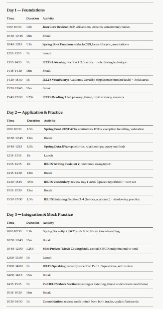
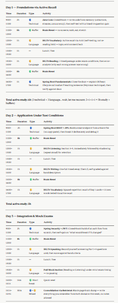

# [Lab 2] Yapılandırılmış Komutlarla Özel Görevler Tasarlama

**Samsung Innovation Campus - Chapter 2: Prompt Engineering Basics**

## Proje Özeti
Bu laboratuvarın amacı; komut (prompt) bileşenlerini sistematik bir şekilde bir araya getirerek prompt mühendisliği döngüsünde ustalaşmak, yapay zekanın davranışını test etmek ve kısıtlamalara ince ayar (tuning) yaparak jenerik bir yapay zeka çıktısını yüksek kaliteli, uygulanabilir ve insan odaklı bir sonuca dönüştürmektir.

---

## Lab 2-1: Step-by-Step Prompt Element Practice

**Mission:** Build a Professional Health Coach to explore how a vague request transforms into a high-quality, actionable AI response.

### Discussion Point Cevapları

1. **Kalitenin en çok değiştiği step:** Kaliteteki en büyük sıçramayı `[Constraints]` eklendiği stepte hissettim, çünkü bu noktadan önce AI genel geçer, herkese uyan tavsiyeler veriyordu; kısıtlar eklenince cevap benim spesifik durumuma göre şekillenmeye başladı.
2. **En "must-have" iki element:** `[Constraints]` ve `[Format]` - Constraints olmadan AI'ın çıktısı gerçekçilikten uzaklaşıyor, Format olmadan ise cevap uygulanabilir bir yapıya dönüşmüyor.
3. **İlk tune edilecek element:** Eğer AI hayal kırıklığı yaratan bir cevap verirse ilk olarak `[Constraints]` bölümünü güncellerim, çünkü çoğu "gerçekçi olmayan" çıktı sorunu kısıtların yetersizliğinden kaynaklanıyor.

> **Activity:** *"I felt the biggest 'quality' jump at Step [Constraints], because it forced the AI to move from generic advice to a plan shaped around my actual constraints. Also, the element I will most often use is [Constraints] because it's the fastest lever for fixing unrealistic outputs."*

---

## Lab 2-2: Creating My Own AI Study Coach with Prompt Engineering

**Mission:** Design an AI Study Coach that generates a realistic, adherence-focused study plan based on a scenario.

Yapay zekanın karmaşık planlama yeteneğini test etmek için, iki farklı odak gerektiren yoğun bir 3 günlük çalışma planı oluşturmasını istedim:
1. **Derin Teknik Odak:** İleri Düzey Java ve Spring Boot.
2. **Dil Hazırlığı:** IELTS İngilizce Sınavı (Karma beceriler).

### Discussion Point Cevapları

1. **Buffer Time:** Programa "kasıtlı esneklik" eklemek için, teknik ve dil çalışmaları arasına sabit 60 dakikalık bir "Brain Reset" bloğu koydum. Bu, beklenmedik gecikmeleri absorbe edecek bir tampon görevi görüyor.
2. **Specific Breaks:** En uzun vadeli odaklanmayı sağlamak için molaların ekransız olmasını şart koştum (yürüyüş, yemek, esneme) - pasif ekran molaları (telefon kontrol etme gibi) zihinsel yorgunluğu azaltmıyor, aksine artırıyor.
3. **Priority Logic:** Bu ilk versiyonda önceliklendirme mantığını eklemedim; bir sonraki iterasyonda "eğer sınav tarihi teknik mülakat tarihinden daha yakınsa, IELTS bloklarının süresini artır" gibi bir koşullu kural eklemeyi planlıyorum.

> **Activity:** *"I think adding a mandatory 60-minute Brain Reset buffer is key to making this plan realistic because it directly addresses the 'hard to stick to plans' problem caused by aggressive context-switching."*

---

## Lab 2-3: Structured Prompt Design

**Mission:** Crafting the Master Template by organizing study coach instructions into a clear, hierarchical structure that the AI can parse with high accuracy.

### Discussion Point Cevapları

1. **Role seçimi:** `[Role]`'ü "Expert AI Study Coach specializing in intensive learning routines" olarak seçtim, çünkü bu, AI'ın cevaplarını genel bir asistan gibi değil, yoğun öğrenme programları konusunda uzmanlaşmış bir koç perspektifinden üretmesini sağlıyor.
2. **Goal'un "execution" odağı:** `[Goal]`'daki "realistic, adherence-focused" ifadesi AI'ın dikkatini sadece bilgi sunmaktan, öğrencinin gerçekten uygulayabileceği bir plan üretmeye kaydırıyor. "Adherence" kelimesi AI'a çıktının sadece doğru değil, sürdürülebilir olması gerektiğini söylüyor.
3. **"Hard to stick to plans" sorununu çözen Constraint:** `[Negative Prompts]` içindeki "DO NOT schedule more than 6 hours of total active studying per day" kuralı bu sorunu doğrudan çözüyor, çünkü aşırı yüklenmiş programların terk edilme sebebi genellikle gerçekçi olmayan süre beklentileridir.
4. **Verification'ın "double-check" mantığı:** Prompt'a eklediğim doğrulama mantığı, AI'ın planı sunmadan önce kendi kısıtlarına uyup uymadığını kontrol etmesini sağlıyor - örneğin hiçbir teknik bloğun 2 saati aşmadığını ve iki yoğun konunun art arda gelmediğini teyit ediyor.

> **Activity:** *"I intentionally designed the [Negative Prompts] section to enforce a hard 6-hour daily cap because preventing an exhausting, single-block marathon was the root cause of low adherence. The reason I chose a mandatory 60-minute Brain Reset for the [Constraints] section was to prevent the AI from placing two cognitively intensive topics back-to-back."*

### İyileştirilmiş Ana Komut (Refined Master Prompt)

```text
[Role]
You are an Expert AI Study Coach specializing in intensive learning routines.

[Goal]
Create a realistic, adherence-focused 3-day study schedule for a new graduate engineer.

[Task]
The student needs to study:
1. Technical: Advanced Java and Spring Boot.
2. Language: IELTS English Exam Preparation.

[Constraints]
- Limit deep technical focus (Java/Spring Boot) to maximum 2-hour blocks to prevent burnout.
- Insert at least a 60-minute "Brain Reset / Buffer Time" between Technical and Language studies.
- Include active recall and practice testing methods, not just passive reading.

[Negative Prompts]
- DO NOT schedule more than 6 hours of total active studying per day, leave the rest for life/unplanned events.
- DO NOT place two intensive topics back-to-back without a meaningful break.

[Verification]
Before finalizing the schedule, check that:
- No technical block exceeds 2 hours.
- Every transition between Technical and Language study is separated by at least 60 minutes.
- Total active study time per day does not exceed 6 hours.

[Format]
Provide a daily schedule broken down by hours, explicitly showing the buffer times.
```

---

## 🔄 Lab 2-4: Model Execution and 1st Result Check

### İlk Test (Kısıtlamasız - Unconstrained)
Yapay zekanın iş yükü dağılımını doğal olarak nasıl ele aldığını gözlemlemek için bilerek `[Role]`, `[Goal]` ve `[Task]` içeren temel bir yapılandırılmış komut verdim, ancak kesin davranışsal kısıtlamaları (constraints) dışarıda bıraktım.



### Sonuç ve Değerlendirme
Yapay zeka mantıksal olarak yapılandırılmış ancak insan doğası için son derece gerçek dışı bir program sundu. Aralarında sadece 15 dakikalık molalar olan 1.5 saatlik ağır Java kodlama bloklarının hemen ardına IELTS okuma testlerini yığdı.

### Discussion Point Cevapları

1. **Kalitenin en çok değiştiği section:** `[Constraints]` bölümü eklenmeden önceki basit prompt ile karşılaştırıldığında, en büyük kalite farkı zaman yönetimi ve mola yapısında ortaya çıktı - basit prompt teknik derinliği yakaladı ama insan sürdürülebilirliğini tamamen gözden kaçırdı.
2. **En "must-have" iki element:** `[Constraints]` ve `[Negative Prompts]` - ikisi birlikte hem pozitif kuralları (ne yapılmalı) hem negatif sınırları (ne yapılmamalı) tanımlayarak planı gerçekçi kılıyor.
3. **İlk tune edilecek element:** Eğer AI yine hayal kırıklığı yaratan bir cevap verirse, ilk olarak `[Negative Prompts]` bölümünü genişletirim, çünkü AI'ın "yapmaması gerekenleri" açıkça belirtmek, "yapması gerekenleri" belirtmekten daha etkili sınır koyuyor.

> **Activity Reflection (Lab 2-4):**
> *"Initially, the AI scheduled intense context-switching between programming and language without meaningful buffer times, so I plan to refine the [Constraints] by enforcing a mandatory 60-minute 'Brain Reset' to improve realism and prevent burnout."*

---

## Lab 2-5: Prompt 1st Tuning and Re-execution

Oluşan "robotik" programlamayı düzeltmek için komuta katı `[Constraints]` (Kısıtlamalar) ve `[Negative Prompts]` (Negatif Komutlar) ekleyerek ince ayar yaptım (bkz. Lab 2-3'teki Refined Master Prompt).



### Final Sonucu ve Değerlendirme
Yapay zeka mantığını tamamen bu kurallara uyarladı. 1 saatlik ekransız "Beyin Sıfırlama" (Brain Reset) molaları ekledi, tamamen aktif hatırlama tekniklerine (Feynman tekniği, kitapsız kod yazma) geçti ve günlük çalışma süresini kesin bir şekilde 5-6 saatle sınırlayarak günün geri kalanını beklenmedik yaşam olaylarına (buffer) açık bıraktı.

### Discussion Point Cevapları

1. **En çok zorlanılan instruction / "instruction drift" sebebi:** AI, ilk denemede toplam aktif çalışma süresini 6 saat sınırının altında tutmakta hafif zorlandı (Day 1'de 6 saat yerine önce 6.5 saat gibi bir toplam çıkmıştı) - bunun sebebi büyük olasılıkla modelin bireysel blokları toplarken kümülatif sınırı ikinci planda tutmasıydı.
2. **Eklenecek bir Negative Prompt:** "DO NOT let individual session totals silently exceed the daily cap - recalculate and adjust the last block if needed" şeklinde bir kural eklerdim, böylece AI kendi toplamını çıktıyı vermeden önce yeniden kontrol etmeye zorlanır.
3. **Verification'ın katkısı:** `[Verification]` adımı, AI'ın planı sunmadan önce kendi kurallarına karşı kendi kendini denetlemesini sağladı; bu sayede 2 saati aşan teknik bloklar ve art arda gelen yoğun konular gibi hatalar büyük ölçüde önlendi, ancak toplam saat hesaplamasında küçük bir sapma yine de fark edilebilirdi.

> **Activity Reflection (Lab 2-5):**
> *"By adjusting the [Negative Prompts] and adding a [Verification] step, I was able to solve the problem of information overload and robotic scheduling, resulting in a plan that is highly adaptable, human-friendly, and strictly adheres to a maximum 6-hour daily limit."*

---

## Temel Çıkarımlar ve Strateji

> *"I intentionally designed the [Constraints] section to enforce mandatory 60-minute breaks because preventing cognitive fatigue during context-switching is critical. The reason I chose 'DO NOT schedule more than 6 hours' for the [Negative Prompts] section was to prevent the AI from creating an overly exhausting, single-block study marathon, ensuring long-term adherence. Adding a [Verification] step closed the loop by forcing the AI to check its own output against these rules before presenting it, rather than relying on me to catch violations after the fact."*